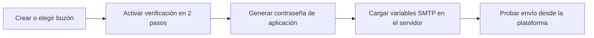

# Guía: configurar correo SMTP con Google Workspace (Hospital Santa Fe)

Esta guía explica, paso a paso, cómo preparar el buzón institucional (por ejemplo `pagos@hospitalsantafepanama.com`) para que la **plataforma de preadmisión y turnos** pueda enviar correos automáticos: confirmación de preadmisión, código de verificación de email, avisos de turno y encuestas.

**Importante:** la plataforma **no debe usar la contraseña normal** de la cuenta de Google. Se usa una **contraseña de aplicación** de 16 caracteres, generada por Google solo para este sistema.

---

## 1. Qué necesita el hospital antes de empezar

| Requisito | Detalle |
|-----------|---------|
| Cuenta de Google Workspace | Dominio del hospital (ej. `@hospitalsantafepanama.com`) administrado en [admin.google.com](https://admin.google.com). |
| Buzón dedicado (recomendado) | Ejemplo: `pagos@hospitalsantafepanama.com` o `noreply@hospitalsantafepanama.com`, usado **solo** para envíos del sistema. |
| Acceso | Una persona con permiso para iniciar sesión en esa cuenta **o** un administrador de Workspace que active verificación en 2 pasos y contraseñas de aplicación. |
| Acceso al servidor | Quien despliegue la API (Railway, VPS, etc.) debe poder cargar **variables de entorno** (secretos), **sin subirlas al código ni a Git**. |

### Correos que envía la plataforma hoy

- Confirmación al completar **preadmisión digital**
- **Código de verificación** del correo en el formulario de preadmisión
- **Turno creado** y **turno llamado** (paciente con cuenta)
- Invitación a **encuesta** de satisfacción

---

## 2. Resumen del proceso (vista rápida)



1. Crear o elegir el buzón (ej. `pagos@...`).
2. Activar **verificación en 2 pasos** en esa cuenta.
3. Crear una **contraseña de aplicación** (16 caracteres).
4. Configurar en el servidor las variables `SMTP_*` (ver sección 6).
5. Probar preadmisión o verificación de correo en el entorno acordado.

---

## 3. Paso a paso — Administrador de Google Workspace (opcional pero útil)

Si el hospital centraliza políticas en el panel de administración:

### 3.1 Verificar que el buzón existe

1. Entrar a [https://admin.google.com](https://admin.google.com) con cuenta de administrador.
2. Ir a **Directorio** → **Usuarios**.
3. Buscar el usuario del buzón (ej. `pagos`) o **Agregar usuario** si aún no existe.
4. Anotar el correo completo: `pagos@hospitalsantafepanama.com`.

### 3.2 Permitir acceso de la cuenta (si aplica)

- Si solo el sistema envía correo, el buzón puede ser **sin uso humano diario**, pero debe poder autenticarse por SMTP con contraseña de aplicación.
- Confirmar que no hay política que **bloquee el acceso de aplicaciones menos seguras** de forma incompatible (en Workspace moderno lo habitual es **2FA + contraseña de aplicación**, no “aplicaciones menos seguras”).

### 3.3 Verificación en 2 pasos (obligatoria para contraseñas de aplicación)

La cuenta del buzón **debe** tener activada la verificación en 2 pasos. Puede hacerlo el administrador impersonando al usuario o el responsable del buzón:

1. Iniciar sesión en Google con `pagos@hospitalsantafepanama.com` (o la cuenta elegida).
2. Ir a [https://myaccount.google.com/security](https://myaccount.google.com/security).
3. En **Verificación en 2 pasos** → **Activar** y completar el asistente (teléfono, app Authenticator, etc.).

> Sin este paso, Google **no muestra** la opción de crear contraseñas de aplicación.

### 3.4 Si no aparece “Contraseñas de aplicaciones”

En [admin.google.com](https://admin.google.com):

1. **Seguridad** → **Configuración de seguridad** → **Verificación en 2 pasos**.
2. Revisar que la política permita **contraseñas de aplicación** para la unidad organizativa del buzón (o para todo el dominio, según política del hospital).
3. Guardar cambios y esperar unos minutos; volver a intentar en la cuenta del buzón.

Si el hospital usa **SSO estricto** o bloquea contraseñas de aplicación por política, el área de TI debe habilitarlas para esta cuenta o valorar **relé SMTP** / otro método acordado con soporte.

---

## 4. Paso a paso — Generar la contraseña de aplicación

Realizar esto **iniciando sesión con la cuenta que enviará el correo** (ej. `pagos@hospitalsantafepanama.com`):

1. Abrir [https://myaccount.google.com/apppasswords](https://myaccount.google.com/apppasswords).  
   - Si no carga, ir a **Seguridad** → **Verificación en 2 pasos** → al final, **Contraseñas de aplicaciones**.
2. Puede pedir confirmar la contraseña de Google de la cuenta otra vez.
3. En **Seleccionar app**, elegir **Correo** (o **Otra (nombre personalizado)** → escribir `Hospital Santa Fe Plataforma`).
4. En **Seleccionar dispositivo**, elegir **Otro** → nombre: `Servidor preadmision` o `API producción`.
5. Pulsar **Generar**.
6. Google muestra una contraseña de **16 caracteres** en **4 grupos de 4**, separados por **espacios** (ej. `abcd efgh ijkl mnop`).  
   Es solo formato visual: **no lleva guiones** (`-`).

### Cómo colocarla en `SMTP_PASS` (`.env` o secretos del servidor)

| Forma | ¿Válida? | Ejemplo |
|-------|----------|---------|
| **Sin espacios** (recomendado) | Sí | `SMTP_PASS=abcdefghijklmnop` |
| **Con espacios** (como la muestra Google) | Sí, suele funcionar | `SMTP_PASS=abcd efgh ijkl mnop` |
| **Con guiones** | **No** — los guiones no forman parte de la clave | ~~`abcd-efgh-ijkl-mnop`~~ |

**Recomendación:** copiar los 16 caracteres y **quitar todos los espacios** (pegar en un bloc de notas, borrar espacios, pegar en `.env`). Así evita errores al copiar.

```env
# Correcto (16 letras seguidas):
SMTP_PASS=abcdefghijklmnop

# También correcto (con espacios, sin comillas):
SMTP_PASS=abcd efgh ijkl mnop

# Incorrecto (guiones — solo era un ejemplo genérico en plantillas, no es la clave de Google):
# SMTP_PASS=abcd-efgh-ijkl-mnop
```

### Qué hacer con esa contraseña

| Hacer | No hacer |
|-------|----------|
| Copiarla **una vez** y guardarla en el gestor de secretos del servidor (Railway, Azure, etc.) | Pegarla en correos, WhatsApp o documentos compartidos |
| Usarla solo en la variable `SMTP_PASS` | Subirla al repositorio Git |
| Rotarla si hay sospecha de fuga | Usar la contraseña normal de inicio de sesión de Google |
| Quitar espacios o pegar tal cual Google (con espacios) | Inventar guiones ni otros separadores |

---

## 5. Valores SMTP recomendados para la plataforma

Estos son los valores que usa el backend (`notifications.service.ts`) con **nodemailer** y Gmail / Google Workspace:

| Variable | Valor recomendado | Descripción |
|----------|-------------------|-------------|
| `SMTP_HOST` | `smtp.gmail.com` | Servidor SMTP de Google |
| `SMTP_PORT` | `587` | Puerto con STARTTLS (el más usado) |
| `SMTP_USER` | `pagos@hospitalsantafepanama.com` | Misma cuenta con la que se generó la contraseña de aplicación |
| `SMTP_PASS` | *(contraseña de aplicación de 16 caracteres)* | **No** es la clave de inicio de sesión |
| `SMTP_FROM` | `"Hospital Santa Fe <pagos@hospitalsantafepanama.com>"` | Nombre y correo que verá el paciente como remitente |
| `NODE_ENV` | `production` | En el servidor de producción, para enviar correos reales |

**Opcional en pruebas locales** (solo desarrollo):

| Variable | Valor |
|----------|--------|
| `SMTP_SEND_IN_DEV` | `true` | Permite envío real sin poner `NODE_ENV=production` |

**Puerto alternativo (solo si 587 está bloqueado en la red del hospital):**

| Variable | Valor |
|----------|--------|
| `SMTP_PORT` | `465` |
| *(y en código podría requerirse `secure: true`; hoy el proyecto usa 587 con `secure: false`)* |

Si 587 falla por firewall, informar al equipo de desarrollo para ajustar el conector.

---

## 6. Cargar la configuración en el servidor (sin poner secretos en el código)

### 6.1 Regla de seguridad

- **Nunca** incluir `SMTP_PASS` en el código fuente, en capturas públicas ni en el repositorio Git.
- El archivo `.env` local está en `.gitignore`; en producción usar **Secretos** del proveedor de hosting.

### 6.2 Ejemplo — Railway (o similar)

1. Abrir el proyecto del **backend** en el panel de hosting.
2. Ir a **Variables** / **Secrets**.
3. Agregar cada variable:

```env
SMTP_HOST=smtp.gmail.com
SMTP_PORT=587
SMTP_USER=pagos@hospitalsantafepanama.com
SMTP_PASS=xxxxxxxxxxxxxxxx
SMTP_FROM=Hospital Santa Fe <pagos@hospitalsantafepanama.com>
NODE_ENV=production
FRONTEND_URL=https://su-dominio-frontend.com
```

4. **Redesplegar** el backend para que tome las variables nuevas.

### 6.3 Ejemplo — archivo `.env` solo en el PC del desarrollador (pruebas)

En la raíz del proyecto, copiar `.env.example` a `.env` y completar (ese archivo **no** se sube a Git):

```env
SMTP_HOST=smtp.gmail.com
SMTP_PORT=587
SMTP_USER=pagos@hospitalsantafepanama.com
SMTP_PASS=abcd efgh ijkl mnop
SMTP_FROM="Hospital Santa Fe <pagos@hospitalsantafepanama.com>"
SMTP_SEND_IN_DEV=true
```

Reiniciar el backend después de guardar.

---

## 7. Cómo probar que funciona

### 7.1 Prueba A — Verificación de correo (preadmisión)

1. Abrir el formulario público de **Preadmisión digital**.
2. En el paso de datos de contacto, ingresar un **correo real** al que tengan acceso.
3. Clic en **Enviar código al correo**.
4. Revisar bandeja de entrada y **spam**; debe llegar un correo con asunto similar a: `Código de verificación - Hospital Santa Fe`.
5. Si en desarrollo no hay SMTP configurado, la pantalla puede mostrar `Código de prueba (desarrollo): ######` — eso indica que **aún no** se envía correo real.

### 7.2 Prueba B — Confirmación de preadmisión

1. Completar y **enviar** una preadmisión de prueba.
2. El paciente debe recibir un correo con asunto similar a: `Confirmación de preadmisión #123 - Hospital Santa Fe`.
3. El cuerpo debe incluir referencia, área (Radiología/Laboratorio), fecha y código para llegada.

### 7.3 Si no llega el correo

| Revisión | Acción |
|----------|--------|
| Variables en el servidor | Confirmar que `SMTP_*` están en el servicio correcto (backend) y que hubo redeploy. |
| `NODE_ENV` / `SMTP_SEND_IN_DEV` | En producción: `NODE_ENV=production`. En local: `SMTP_SEND_IN_DEV=true`. |
| Usuario y contraseña | `SMTP_USER` = correo exacto; `SMTP_PASS` = contraseña de **aplicación**, no la clave normal. |
| Remitente | `SMTP_FROM` debe usar el mismo dominio autorizado (`@hospitalsantafepanama.com`). |
| Logs del backend | Buscar `Email sent to` (éxito) o errores `Invalid login`, `Authentication failed`. |
| Google Admin | Revisar en [admin.google.com](https://admin.google.com) → **Informes** → **Correo** si hay bloqueos o cuotas. |
| Spam | Pedir al paciente revisar carpeta de spam y marcar como “No es spam”. |

---

## 8. Errores frecuentes y solución

| Mensaje / síntoma | Causa probable | Solución |
|-------------------|----------------|----------|
| `Invalid login` / `535 Authentication failed` | Contraseña incorrecta o no es contraseña de aplicación | Regenerar contraseña de aplicación y actualizar `SMTP_PASS` |
| No aparece “Contraseñas de aplicaciones” | 2FA no activada o bloqueada por política | Activar 2FA en la cuenta; revisar política en Admin Console |
| Correo no sale en desarrollo | Falta `SMTP_SEND_IN_DEV` y no es producción | Poner `SMTP_SEND_IN_DEV=true` o probar en entorno con `NODE_ENV=production` |
| Llega desde otro remitente / rebote | `SMTP_FROM` distinto de `SMTP_USER` sin permiso “Enviar como” | Usar el mismo correo en ambos o configurar alias en Workspace |
| Timeout al conectar puerto 587 | Firewall del hospital/hosting | Abrir salida TCP 587 o consultar TI; valorar puerto 465 con ajuste técnico |
| “Less secure app” (cuentas antiguas) | Método obsoleto | Usar **contraseña de aplicación**, no “aplicaciones menos seguras” |

---

## 9. Buenas prácticas para el hospital

1. **Buzón dedicado** para el sistema, no la cuenta personal de un empleado.
2. **Rotar** la contraseña de aplicación si alguien con acceso deja el hospital o si hubo incidente.
3. **Lista de distribución** opcional: si quieren que internamente copien los envíos, configurar regla en Workspace (no es obligatorio para que la plataforma funcione).
4. **Límites de envío:** Google Workspace tiene límites diarios de envío; para el volumen típico de preadmisiones suele ser suficiente; consultar cuotas si hacen campañas masivas.
5. **Privacidad:** los correos llevan datos del paciente; cumplir política interna de protección de datos y no reenviar logs con contenido sensible.

---

## 10. Checklist final para entregar a TI / proveedor de hosting

- [ ] Buzón creado: `________________@hospitalsantafepanama.com`
- [ ] Verificación en 2 pasos activada en esa cuenta
- [ ] Contraseña de aplicación generada y guardada en gestor de secretos
- [ ] Variables `SMTP_HOST`, `SMTP_PORT`, `SMTP_USER`, `SMTP_PASS`, `SMTP_FROM` cargadas en el servidor del **backend**
- [ ] `NODE_ENV=production` en producción (o `SMTP_SEND_IN_DEV=true` solo para pruebas acordadas)
- [ ] Redeploy del backend ejecutado
- [ ] Prueba de código de verificación recibida en bandeja real
- [ ] Prueba de confirmación de preadmisión recibida
- [ ] Documentación interna: quién rota la contraseña y cada cuánto

---

## 11. Contacto con desarrollo

Si tras seguir esta guía el envío sigue fallando, enviar al equipo de desarrollo (sin pegar la contraseña en el ticket):

- Entorno (producción / prueba)
- Correo del buzón (`SMTP_USER`)
- Fragmento de log del backend (sin `SMTP_PASS`)
- Hora aproximada de la prueba y correo destino usado

---

*Documento alineado con la implementación en `backend/src/notifications/notifications.service.ts` y variables en `.env.example`.*
